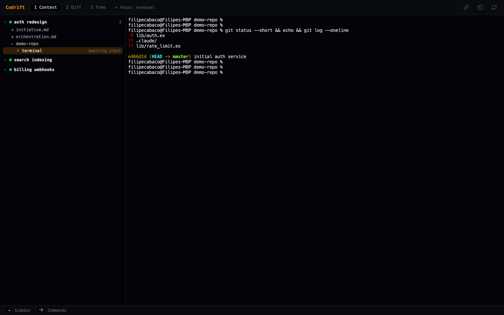
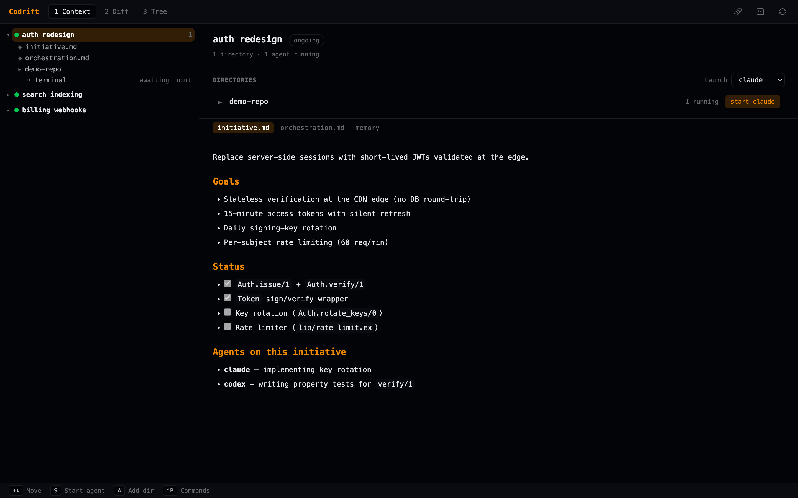
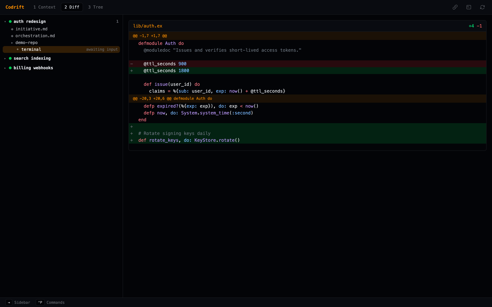

# Codrift

> Drive multiple AI coding agents across your projects from one desktop app.

Codrift is a desktop app for running Claude Code, Codex, Opencode, Gemini, Copilot, and shell agents side-by-side. You group directories into **initiatives**, launch agents against each one, watch their output live in embedded terminals, review diffs, and let them share knowledge through a built-in memory store.



Codrift is a Tauri app: a native window wrapping a Svelte UI, backed by an Elixir
(Francis) server that manages agents, worktrees, memory, and integrations.

---

## Features

- **Native desktop app** — sidebar + live agent terminals (xterm.js), keyboard-driven, on macOS and Linux
- **Multiple agents per directory** — Claude Code, Codex, Opencode, Gemini, Copilot, and a raw terminal shell, all running simultaneously
- **Git worktrees** — each directory gets an isolated branch; agents never touch your main checkout
- **Live diff view** — colour-coded split/unified diff per initiative, updated as agents work
- **Tree view** — mode `3` shows a file-tree browser with syntax-highlighted previews and an in-app editor
- **Shared memory** — FTS5 knowledge base per initiative; agents search it before starting, write to it when done
- **MCP server** — Claude Code and other tools connect to Codrift and call its tools over SSE
- **External integrations** — pull context from GitHub, Linear, and GitLab
- **Session persistence** — Claude sessions survive restarts; agents resume where they left off
- **Context folders** — each initiative has `~/.codrift/initiatives/{id}/` picked up automatically by `--add-dir`

---

## Quick start

Download the latest release for your platform from
[GitHub Releases](https://github.com/filipecabaco/codrift/releases):

| Platform | Bundle |
|----------|--------|
| macOS | `.dmg` |
| Linux | `.AppImage` |

Or use the installer, which also puts the headless `codrift` CLI on your `PATH`:

```bash
curl -fsSL https://codrift.sh/install.sh | sh
```

Or run from source:

```bash
mix deps.get
cd assets && npm install && cd ..
mix ex_tauri.install   # first time only — sets up the Tauri toolchain
mix ex_tauri.dev       # launch the app with hot reload
```

Then register the MCP server so Claude Code can talk to Codrift:

```bash
codrift mcp install
# runs: claude mcp add codrift --transport sse http://localhost:7437/mcp/sse \
#         --header "X-Codrift-Token: <token from ~/.codrift/auth-token>"
```

---

## Core concepts

### Initiatives

An initiative is a named unit of work — a feature, bug fix, or project milestone. Each initiative holds one or more project directories and tracks its own status (`planning → ongoing → done → archived`). Everything — agents, memory, worktrees, integrations — lives under an initiative.

```
codrift initiative create "auth redesign"
codrift initiative add-dir <id> ~/projects/backend
codrift initiative add-dir <id> ~/projects/frontend
```

### Git worktrees

Codrift can create a git worktree on a dedicated branch (`codrift/{id}/{slug}`) for any directory in an initiative. Agents operate there and their changes stay isolated until you're ready to merge.

Enable a worktree from the CLI (`codrift initiative worktree-enable <id> <path>`), or set `worktree_default` on an initiative so new directories inherit it. See [docs/worktrees.md](docs/worktrees.md).

### Shared memory

Each initiative has a searchable knowledge base (SQLite FTS5). Agents write decisions, summaries, and code snippets to it; new agents search it before starting work — saving tokens and keeping them aligned across sessions.

```bash
codrift memory search <id> "authentication"
codrift memory add    <id> decision "use JWT not sessions"
codrift memory recent <id>
```

Agents can also call these as MCP tools (`memory_search`, `memory_add`, …). See [docs/memory.md](docs/memory.md).

### MCP server

While Codrift is running, an MCP server listens at `http://localhost:7437/mcp/sse`.
State-changing requests authenticate with the local token from
`~/.codrift/auth-token` (sent as an `X-Codrift-Token` header — `codrift mcp
install` configures this automatically). Any connected agent can call:

| Category | Tools |
|----------|-------|
| Initiatives | `list_initiatives`, `create_initiative`, `add_dir`, `delete_initiative`, `set_initiative_status`, `get_diff` |
| Agents | `list_agents`, `start_agent`, `send_to_agent`, `get_agent_output` |
| Memory | `memory_search`, `memory_add`, `memory_delete`, `memory_recent`, `memory_list` |
| Integrations | `start_oauth_flow`, `get_oauth_status`, `list_integration_items`, `import_from_integration`, `sync_initiative_context` |

---

## Keyboard reference

### Global

| Key | Action |
|-----|--------|
| `j` / `k` / `↑` / `↓` | Navigate sidebar |
| `1` / `2` / `3` | Context / Diff / Tree view |
| `r` | Refresh initiatives & agents |
| `Ctrl+P` | Command palette |
| `Ctrl+B` | Collapse / expand sidebar |
| `Ctrl+Q` | Quit |

### Initiatives & agents

| Key | Action |
|-----|--------|
| `n` | New initiative |
| `a` | Add directory to initiative |
| `s` | Start a Claude agent in the directory under the cursor |
| `t` | Start a raw `$SHELL` terminal in the directory under the cursor |
| `d` | Delete or stop (context-sensitive) |
| `o` | Start orchestration for the selected initiative |
| `[` / `]` | Cycle initiative status |

Use the **Launch** dropdown next to a directory (or the palette) to start Codex,
Opencode, Gemini, or Copilot.

### Context, tree & editor

| Key | Action |
|-----|--------|
| `e` | Open the selected file in the editor (Vim mode — `:w` / `⌘S` to save) |
| `Tab` / `Shift+Tab` | Cycle focus between sidebar and terminal |

All keys are configurable in `~/.codrift/keybindings.json`. See [docs/keyboard.md](docs/keyboard.md) for the full reference.

---

## External integrations

Pull issue context directly into an initiative from:

**GitHub Issues · GitHub Projects · Linear Issues · Linear Projects · GitLab**

```bash
codrift integration auth github       # OAuth2 browser flow
codrift integration list github       # list open issues
codrift integration import github 42  # seed an initiative from issue #42
```

Both OAuth (PKCE / device flow, handled in-app) and personal API token fallbacks are supported. No secrets are stored in the binary. See [docs/integrations.md](docs/integrations.md).

---

## CLI reference

The desktop app is the primary interface. A headless CLI ships alongside it for
scripting and MCP registration:

```
codrift mcp install

codrift initiative list
codrift initiative create <name>
codrift initiative add-dir <id> <path>
codrift initiative delete  <id>
codrift initiative worktree-status  <id>
codrift initiative worktree-enable  <id> <path>
codrift initiative worktree-disable <id> <path>

codrift memory search <id> <query>
codrift memory add    <id> <type> <content>
codrift memory recent <id>
codrift memory list   <id> <type>
codrift memory delete <id> <rowid>
codrift memory stats  <id>

codrift integration services
codrift integration auth   <service>
codrift integration list   <service>
codrift integration import <service> <item_id>
codrift integration revoke <service>
codrift integration tokens
```

---

## Screens

| Context | Diff | Tree |
|---|---|---|
| [](docs/images/context-overview.png) | [](docs/images/diff-view.png) | [](docs/images/tree-view.png) |

Also: the [command palette](docs/images/command-palette.png), [shared memory](docs/images/memory-view.png), and [integrations](docs/images/integrations.png).

---

## Documentation

[Architecture](docs/architecture.md) · [Keyboard reference](docs/keyboard.md) · [Tree view](docs/tree-view.md) · [Diff mode](docs/diff-mode.md) · [Worktrees](docs/worktrees.md) · [Memory](docs/memory.md) · [Integrations](docs/integrations.md) · [Agent profiles](docs/agent-profiles.md) · [Modules](docs/modules.md) · [Decisions](docs/decisions.md)

---

## Architecture

```
Tauri window (Rust)  ── spawns ──▶  Elixir sidecar ("desktop" release)
   Svelte UI (xterm.js)                Codrift (Application)
        │  HTTP + SSE  :7437             └── Codrift.Supervisor (:one_for_one)
        └───────────────────────────────────┤ Registry (AgentRegistry)
                                             ├── Codrift.Initiative.Store
                                             ├── Codrift.SessionStore (SQLite)
                                             ├── Codrift.OAuth.StateStore
                                             ├── Codrift.AgentSupervisor
                                             │     └── Codrift.AgentProcess (erlexec PTY)
                                             ├── {Task.Supervisor, Codrift.TaskSupervisor}
                                             ├── Codrift (Francis / Bandit) — HTTP + SSE
                                             └── Codrift.ShutdownManager (desktop only)
```

See [docs/architecture.md](docs/architecture.md) and [docs/modules.md](docs/modules.md).

---

## Development

```bash
mix deps.get
unbuffer mix test        # full test suite
mix credo --strict
mix dialyzer

mix ex_tauri.dev         # run the desktop app with hot reload
mix ex_tauri.build       # produce a platform bundle
```

**Stack:** Elixir · [Francis](https://github.com/filipecabaco/francis) · [ex_tauri](https://github.com/filipecabaco/ex_tauri) · Svelte · xterm.js · SQLite (Exqlite) · erlexec

### Supported platforms

| Platform | Target |
|----------|--------|
| macOS (Apple Silicon) | `aarch64-apple-darwin` |
| macOS (Intel) | `x86_64-apple-darwin` |
| Linux x86\_64 | `x86_64-linux-gnu` |
| Linux arm64 | `aarch64-linux-gnu` |

---

## License

MIT
</content>
