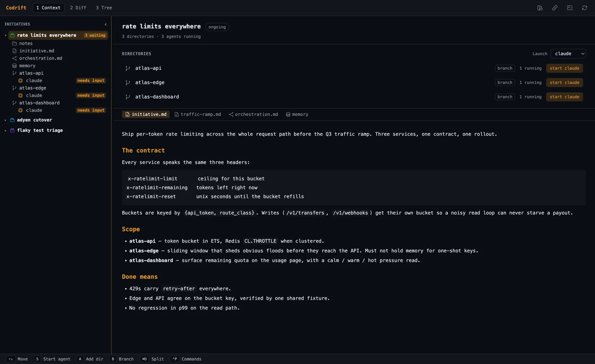

# Architecture

## Supervision tree

```
Codrift (Application)
  └── Codrift.Supervisor (:one_for_one)
      ├── {Registry, name: Codrift.AgentRegistry}
      │     Agent ID → pid lookup (+ initiative_id metadata)
      ├── {Registry, name: Codrift.ConductorRegistry}
      │     Initiative ID → conductor pid lookup
      ├── Codrift.SessionStore
      │     GenServer — SQLite-backed agent session UUIDs at ~/.codrift/codrift.db
      ├── Codrift.Initiative.Store
      │     GenServer — JSON-persisted initiative state at ~/.config/codrift/initiatives.json
      ├── Codrift.AgentSupervisor
      │     DynamicSupervisor — one child per running agent
      │       └── Codrift.AgentProcess
      │             GenServer + erlexec PTY → external CLI (Claude, Codex, Opencode, Gemini, Copilot, Cursor, shell)
      ├── Codrift.ConductorSupervisor
      │     DynamicSupervisor — one Codrift.Conductor per orchestrated initiative
      ├── {Task.Supervisor, name: Codrift.TaskSupervisor}
      │     Async agent start tasks and OAuth device-flow polling
      ├── Codrift.OAuth.StateStore
      │     GenServer — in-memory PKCE verifier state (10-minute TTL)
      ├── Codrift.Scheduler
      │     Quantum — runs Codrift.Integration.Sync every 5 minutes
      ├── Codrift.Freshness
      │     GenServer — polls initiatives.json and each memory.db for writes made
      │     by another OS process (the CLI), turning them into lifecycle frames
      ├── Codrift (Francis / Bandit)
      │     HTTP + WebSocket server on port 43117 (SSE only for the MCP transport)
      └── Codrift.ShutdownManager        (desktop release only)
            Unix-socket heartbeat from the Tauri shell; stops the backend when the app closes
```

## HTTP routes

| Method | Path | Description |
|--------|------|-------------|
| `GET` | `/` | Returns `"ok"` |
| `GET` | `/api/health` | `%{ok: true}` liveness probe the UI polls to detect a dropped server |
| `POST` | `/api/rpc` | **Generic op endpoint** — `{name, args}` → `Codrift.Core.call/2`; backs the whole UI |
| `GET` | `/api/initiatives` | List initiatives (JSON) |
| `GET` | `/api/diff/:id` | Diff for an initiative (JSON) |
| `GET` | `/api/agent/:id` | Agent status (JSON) |
| `GET` | `/api/agent/:id/output` | Recent PTY output, Base64, oldest-first (`?n=`, ≤1000) — terminal scrollback replay |
| `WS` | `/ws/initiative/:id` | The live surface, both ways: `output` / `status` / `stopped` / `conductor_*` / `initiative_*` / `memory_changed` frames down (Base64 payloads for PTY bytes); `{t:"d",agent_id,d}` keystrokes and `{t:"r",agent_id,cols,rows}` resizes up |
| `POST` | `/mcp` | MCP JSON-RPC, streamable HTTP (2025-03-26) — the response is the body. With `?sessionId=`, it is the POST half of the HTTP+SSE transport instead and is only acknowledged (202) |
| `GET`/`DELETE` | `/mcp` | 405 — no server-initiated stream, no session teardown |
| `SSE` | `/mcp/sse` | MCP HTTP+SSE transport (2024-11-05). Opens a session and carries its JSON-RPC responses |
| `GET` | `/oauth/start/:service` | Begin OAuth2 flow |
| `GET` | `/oauth/callback/:service` | OAuth2 redirect callback |
| `GET` | `/oauth/status` | Token status for all services |
| `Static` | `/` | The Vite-built Svelte SPA from `priv/static` (`index.html`, `assets/…`) |

> Agent output and input both ride `/ws/initiative/:id`, one socket per
> initiative. `POST /api/rpc` handles everything else. `priv/static` also carries
> two standalone HTML prototypes (`diff.html`, `term.html`) kept for local
> experimentation; they are not part of the app shell.

## Pure modules (no processes)

| Module | Role |
|--------|------|
| `Codrift.Initiative` | Struct + serialisation + status lifecycle |
| `Codrift.Initiative.DirEntry` | Per-dir struct: source path, worktree path, `effective_path/1` |
| `Codrift.Worktree` | Git worktree lifecycle: ensure, remove, branch naming |
| `Codrift.Memory` | Per-initiative FTS5 knowledge base (SQLite, opens own connection per call) |
| `Codrift.Diff` | Git diff generation + parser |
| `Codrift.Agent` | Behaviour for CLI adapters; `available_adapters/0` detects installed CLIs; `tui?/0` callback for Ink/Bubble Tea adapters |
| `Codrift.Integration` | Behaviour for external service adapters |
| `Codrift.Integration.HTTP` | Req wrapper — GET/POST/GraphQL with JSON, 15s timeout |
| `Codrift.Integration.Sync` | Re-fetch item and refresh the `source` block of `initiative.md` |
| `Codrift.OAuth` | Token acquisition: PKCE browser, device flow |
| `Codrift.OAuth.Config` | Per-service OAuth parameters, env var names, endpoints |
| `Codrift.MCP.Handler` | JSON-RPC 2.0 dispatch |
| `Codrift.Config.Keybindings` | Loads `~/.codrift/keybindings.json`, merges over defaults; served to the UI via the `get_keybindings` RPC |
| `Codrift.Config.Settings` | Reads/writes `~/.codrift/settings.json`: launch profiles, default agent, default workspace folder, theme, font, per-adapter start counts |

## Frontend

The desktop shell is a Tauri (Rust) window that spawns the Elixir `desktop`
release as a sidecar and points its webview at the Francis server on `:43117`.
The UI is a **Svelte 5** app (`assets/`, built with Vite) that renders agent
output in embedded **xterm.js** terminals (WebGL renderer, Canvas/DOM fallback),
highlights code with **Shiki**, and edits files in a **CodeMirror 6** pane with
Vim mode.

It talks to the backend through two channels: `POST /api/rpc` for all
request/response operations (`assets/src/lib/api.ts`), and one WebSocket per
initiative for live agent output, status and terminal input
(`assets/src/lib/stream.ts`). See `src-tauri/` (Rust shell) and
`assets/src/` (Svelte UI).



The three main-pane tabs — **Context**, **Diff**, and **Tree** — are documented
in [diff-mode.md](diff-mode.md) and [tree-view.md](tree-view.md).

## Data flow

```
User action (Svelte UI)
  → POST /api/rpc  (Codrift.Core.call/2)
    → Codrift.AgentSupervisor.start_agent/4
      → Codrift.AgentProcess (GenServer)
        → erlexec PTY → claude / codex / opencode / gemini / cursor-agent / $SHELL
          → {:agent_output, id, data}
            → Codrift.Web.EventRelay → WS /ws/initiative/:id → xterm.js
            → MCP SSE subscribers (connected agents)

Keystrokes / resize (xterm.js)
  → WS /ws/initiative/:id  (same socket, framed with agent_id)
    → AgentProcess.send_raw / .resize → PTY
```

## Change notification

The initiative list and the memory store have writers outside the open window,
and a UI that only refetched on its own actions could not see them. Both are
announced as WebSocket frames the client patches state from, rather than as a
signal to reload — the client's `load()` fans out `get_initiative_agents` per
initiative, so making it the refresh primitive would turn every rename into
O(initiatives) round trips.

| Frame | Broadcast by | Covers |
|-------|--------------|--------|
| `initiative_created` / `initiative_updated` / `initiative_deleted` | `Codrift.Initiative.Store` on every write | The app itself, an MCP-connected agent, a second window |
| `memory_changed` | `Codrift.Memory` on add and delete | Same |
| all of the above | `Codrift.Freshness`, from a file change on disk | `codrift initiative create` / `codrift memory add`, which run in a separate OS process, and any other external writer |

`Codrift.Memory` and `Codrift.CLI.Initiative` are pure and write their files
directly so they work under `bin/codrift eval` with no booted system. That is
why the CLI cannot broadcast and is polled for instead; when `Freshness` sees
`initiatives.json` move it calls `Store.reload/1`, which both catches the
running store up with disk and broadcasts one frame per actual difference.

Agent output is buffered in `AgentProcess` (newest-first, cap 1000) and streamed
to all subscribers; the Svelte UI replays scrollback from
`GET /api/agent/:id/output` on connect, then feeds live PTY bytes straight into
xterm.js. `Codrift.Core` is the single shared operation layer — the HTTP `/api/rpc`
endpoint, the MCP handler, and the CLI all route through `Core.call/2`.
