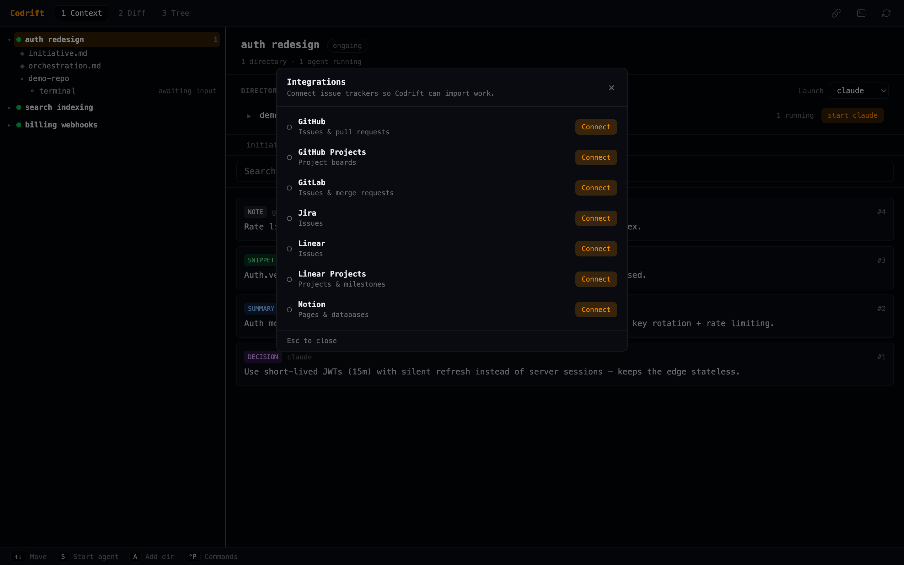

# Integrations

Codrift can pull context from GitHub (Issues & Projects), Linear (Issues & Projects), and GitLab directly into an initiative. Each service supports two auth paths:

- **OAuth (recommended)** — handled inside the app. Tokens are stored at `~/.codrift/oauth_tokens.json` (mode 0600). No secret is ever stored in or shipped with the binary.
- **Env var fallback** — for CI, headless environments, or personal tokens. Set the variables listed under each service and Codrift will use them automatically.

---

## Quick start

1. Register a developer app for the services you want (instructions below).
2. Set the `*_CLIENT_ID` env var for each service.
3. In the Codrift app, click the **Integrations** button in the header to open the connection manager and authorize a service.
4. Import an issue with the CLI (`codrift integration import <service> <item_id>`), or let a connected agent call the `import_from_integration` MCP tool.



---

## GitHub — Issues and Projects

**Auth flow:** Device Flow (RFC 8628). No redirect URI. No client secret.

### Register an OAuth App

1. Go to **github.com → Settings → Developer settings → OAuth Apps**
   → [New OAuth App](https://github.com/settings/applications/new)
2. Fill in:
   - **Application name:** `Codrift`
   - **Homepage URL:** any URL (e.g. `https://github.com/your-org/codrift`)
   - **Authorization callback URL:** leave blank (Device Flow has no callback)
3. Click **Register application**.
4. Copy the **Client ID** shown on the app page. Do **not** generate a client secret.

**GitHub docs:**
- [Creating an OAuth App](https://docs.github.com/en/apps/oauth-apps/building-oauth-apps/creating-an-oauth-app)
- [Device authorization grant](https://docs.github.com/en/apps/oauth-apps/building-oauth-apps/authorizing-oauth-apps#device-flow)

### Configure

```sh
export GITHUB_CLIENT_ID="your-github-client-id"
```

Or hardcode it in `lib/codrift/oauth/config.ex` under the `"github"` key for
distribution.

### Env var fallback (no OAuth app)

```sh
export GITHUB_TOKEN="ghp_..."   # PAT with repo + project scopes
export GITHUB_REPO="owner/repo" # default repo for issue lookups
```

Generate a PAT at [github.com/settings/tokens](https://github.com/settings/tokens).
Required scopes: `repo`, `read:org`, `project` (for Projects v2).

---

## Linear — Issues and Projects

**Auth flow:** PKCE (RFC 7636). Redirect to `localhost:7437`. No client secret.

### Register an OAuth Application

1. Go to **linear.app → Settings → API → OAuth applications**
   → [Create application](https://linear.app/settings/api/applications/new)
2. Fill in:
   - **Application name:** `Codrift`
   - **Redirect URI:** `http://localhost:7437/oauth/callback/linear`
3. Click **Create**.
4. Copy the **Client ID**. Ignore the client secret field — PKCE does not need it.

**Linear docs:**
- [OAuth 2.0 authentication](https://developers.linear.app/docs/oauth/authentication)
- [Creating an OAuth application](https://developers.linear.app/docs/oauth/authentication#create-an-oauth-application)

### Configure

```sh
export LINEAR_CLIENT_ID="your-linear-client-id"
```

`linear` and `linear_projects` share the same client ID and token.

### Env var fallback

```sh
export LINEAR_API_KEY="lin_api_..."
```

Generate a personal API key at
[linear.app/settings/api](https://linear.app/settings/api).

---

## GitLab — Issues

**Auth flow:** PKCE (RFC 7636). Redirect to `localhost:7437`. Registered as a
**public** application (no secret).

### Register an Application

1. Go to **gitlab.com → Preferences → Applications**
   → [Add new application](https://gitlab.com/-/profile/applications)
2. Fill in:
   - **Name:** `Codrift`
   - **Redirect URI:** `http://localhost:7437/oauth/callback/gitlab`
   - **Confidential:** **unchecked** (this marks it as a public client enabling PKCE without a secret)
   - **Scopes:** `read_api`, `read_user`
3. Click **Save application**.
4. Copy the **Application ID** (= client ID). There is no secret for public apps.

For **self-hosted GitLab**, use your instance's admin panel instead and also set
`GITLAB_HOST` (see env vars below).

**GitLab docs:**
- [Configure GitLab as an OAuth 2.0 authentication identity provider](https://docs.gitlab.com/ee/integration/oauth_provider.html)
- [OAuth 2.0 with PKCE](https://docs.gitlab.com/ee/api/oauth2.html#authorization-code-with-proof-key-for-code-exchange-pkce)

### Configure

```sh
export GITLAB_CLIENT_ID="your-gitlab-application-id"
```

### Env var fallback

```sh
export GITLAB_TOKEN="glpat-..."     # personal access token
export GITLAB_PROJECT="group/repo"  # project path (URL-encoded internally)
export GITLAB_HOST="gitlab.mycompany.com"  # only for self-hosted; defaults to gitlab.com
```

Generate a personal access token at
[gitlab.com/-/user_settings/personal_access_tokens](https://gitlab.com/-/user_settings/personal_access_tokens)
with `read_api` scope.

---

## Summary table

| Service | Flow | Env var: client | Env var: fallback token |
|---|---|---|---|
| GitHub Issues | Device Flow | `GITHUB_CLIENT_ID` | `GITHUB_TOKEN` |
| GitHub Projects v2 | Device Flow | `GITHUB_CLIENT_ID` | `GITHUB_TOKEN` |
| Linear Issues | PKCE | `LINEAR_CLIENT_ID` | `LINEAR_API_KEY` |
| Linear Projects | PKCE | `LINEAR_CLIENT_ID` | `LINEAR_API_KEY` |
| GitLab Issues | PKCE | `GITLAB_CLIENT_ID` | `GITLAB_TOKEN` |

---

## Distributing Codrift with client IDs pre-configured

Client IDs are safe to commit — they are public identifiers, not secrets. Once
you have registered apps for each service, set the `client_id` field directly in
`lib/codrift/oauth/config.ex`:

```elixir
"github" => %{
  flow: :device_flow,
  ...
  client_id: "Ov23li...",   # your registered GitHub OAuth App client ID
  ...
}
```

Users who run the released binary will then be able to authorize without setting
any env vars.

---

## Revoking access

In the app: open **Integrations** from the header → **Disconnect** next to the service.

From the CLI:
```sh
codrift integration revoke github
codrift integration tokens   # list currently connected services
```

Tokens are stored in `~/.codrift/oauth_tokens.json`. You can also delete the
file directly to revoke all services at once.
