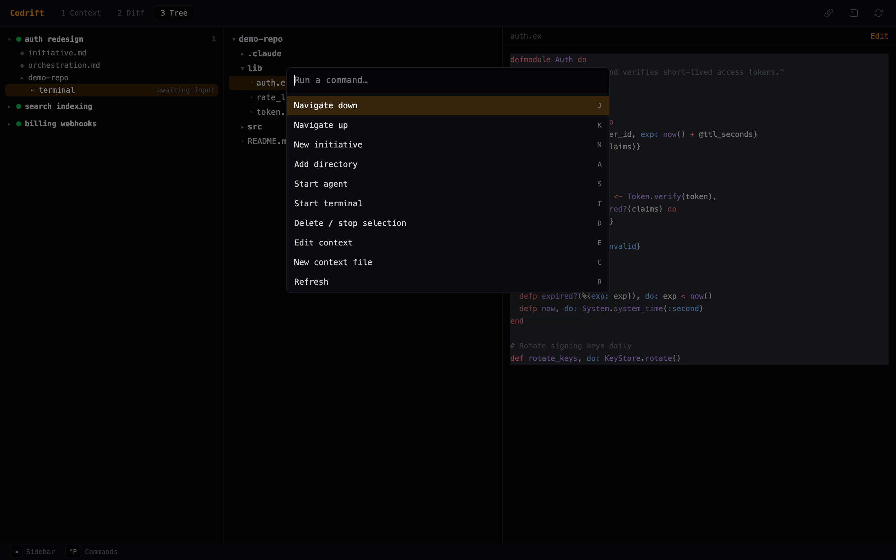

# Keyboard Reference

Codrift is keyboard-driven. The desktop UI loads its key map from the backend
(`get_keybindings` RPC), so the same `~/.codrift/keybindings.json` that the CLI
reads also drives the app. The `Ctrl+P` command palette lists every action with
its current binding.

Keys are dispatched globally except when focus is inside a text field or an agent
terminal — there, bare keys pass through to the field/PTY and only modifier combos
(e.g. `⌃P`, `⌃B`) are intercepted. Arrow keys always navigate the sidebar.



## Global

| Key | Action | Action id |
|-----|--------|-----------|
| `j` / `↓` | Move sidebar cursor down | `navigate_down` |
| `k` / `↑` | Move sidebar cursor up | `navigate_up` |
| `1` | Context view | `context_mode` |
| `2` | Diff view | `diff_mode` |
| `3` | Tree view | `tree_mode` |
| `r` | Refresh (reload initiatives & agents) | `refresh` |
| `Ctrl+P` | Open command palette | `palette` |
| `Ctrl+B` | Collapse / expand sidebar | `toggle_sidebar` |
| `Ctrl+Q` | Quit (handled by the native window) | `quit` |

## Initiatives & agents

| Key | Action | Action id |
|-----|--------|-----------|
| `n` | New initiative | `new_initiative` |
| `a` | Add directory to the current initiative (absolute path) | `add_dir` |
| `s` | Start a Claude agent in the directory under the cursor | `start_agent` |
| `t` | Start a raw `$SHELL` terminal in the directory under the cursor | `start_terminal` |
| `d` | Delete initiative / stop agent (context-sensitive, confirms first) | `delete` |
| `o` | Start orchestration for the selected initiative | `start_orchestration` |
| `[` | Cycle status back (`archived → done → ongoing → planning`) | `status_prev` |
| `]` | Cycle status forward (`planning → ongoing → done → archived`) | `status_next` |

To start a specific adapter (Codex, Opencode, Gemini, Copilot), use the **Launch**
dropdown next to a directory in the Context view, or the command palette. `s`
always launches Claude.

## Context view

| Key | Action | Action id |
|-----|--------|-----------|
| `e` | Open the selected file in the editor | `edit_context` |
| `c` | New context file *(reserved — not yet wired in the UI)* | `new_context` |

## Diff view

| Key | Action | Action id |
|-----|--------|-----------|
| `2` / `*` | Show the diff for the selected initiative | `diff_mode` / `diff_all_files` |
| `v` | Toggle diff layout *(reserved — not yet wired in the UI)* | `toggle_diff_view` |

The diff renders every changed file across the initiative's directories as
syntax-highlighted cards; scroll to move through them.

## Tree view

| Key | Action |
|-----|--------|
| `Enter` / click | Expand / collapse a directory, or open a file in the preview |
| `Tab` / `Shift+Tab` | Cycle focus between the sidebar and the terminal |
| `e` | Open the previewed file in the editor |

## Editor

The editor is a CodeMirror pane with **Vim mode** enabled.

| Key | Action |
|-----|--------|
| `:w` / `:wq` | Save (and quit) |
| `:q` | Close the editor |
| `⌘S` / `Ctrl+S` | Save |

## Agent terminal

| Key | Action |
|-----|--------|
| `Tab` | Focus the terminal from the sidebar (when an agent is selected) |
| `Shift+Tab` | Return focus to the sidebar |
| Any printable key / paste | Forwarded raw to the focused agent PTY |
| `Esc` | Passed through to the agent (needed by Claude, Vim, etc.) |

## Configuring keybindings

Create `~/.codrift/keybindings.json` with any subset of the default map. Use the
**action ids** above as keys:

```json
{
  "navigate_down": "j",
  "navigate_up": "k",
  "new_initiative": "n",
  "add_dir": "a",
  "start_agent": "s",
  "start_terminal": "t",
  "delete": "d",
  "edit_context": "e",
  "new_context": "c",
  "refresh": "r",
  "status_prev": "[",
  "status_next": "]",
  "context_mode": "1",
  "diff_mode": "2",
  "tree_mode": "3",
  "toggle_diff_view": "v",
  "diff_all_files": "*",
  "quit": "ctrl+q",
  "toggle_sidebar": "ctrl+b",
  "palette": "ctrl+p",
  "start_orchestration": "o"
}
```

Unknown ids are ignored; missing ids fall back to the defaults in
`Codrift.Config.Keybindings`. Specs use a single optional modifier
(`ctrl+` — treated the same as `⌘` on macOS) followed by a key.
```
