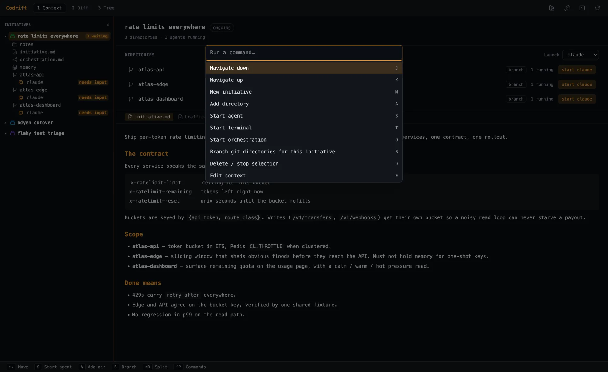

# Keyboard Reference

Codrift is keyboard-driven. The desktop UI loads its key map from the backend
(`get_keybindings` RPC), so the same `~/.codrift/keybindings.json` that the CLI
reads also drives the app. The `Ctrl+P` command palette lists every action with
its current binding.

Keys are dispatched globally except when focus is inside a text field or an agent
terminal — there, bare keys pass through to the field/PTY and only modifier combos
(e.g. `⌃P`, `⌃B`) are intercepted. Arrow keys always navigate the sidebar.



## Global

| Key | Action | Action id |
|-----|--------|-----------|
| `j` / `↓` | Move sidebar cursor down | `navigate_down` |
| `k` / `↑` | Move sidebar cursor up | `navigate_up` |
| `1` | Context view | `context_mode` |
| `2` | Diff view | `diff_mode` |
| `3` | Tree view | `tree_mode` |
| `r` | Refresh (reload initiatives & agents) | `refresh` |
| `Ctrl+P` | Open command palette | `palette` |
| `Ctrl+B` | Collapse / expand sidebar | `toggle_sidebar` |
| `Ctrl+,` / `⌘,` | Open Settings | `settings` |
| `Ctrl+Q` / `⌘Q` | Quit — asks first, listing any agents still running | `quit` |

## Panes & layout

The content area can be split into two independent panes (one level deep). Each
pane is its own viewport — its own initiative, agent, and view — and the sidebar
drives whichever pane is focused (click a pane to focus it). These are
window-management shortcuts, handled directly rather than through the remappable
keymap, so they are fixed.

| Key | Action |
|-----|--------|
| `⌘D` | Split the content area side by side (press again to collapse the split) |
| `⌘⇧D` | Split the content area stacked top/bottom |
| `⌘⌃=` | Balance the split back to 50/50 |
| `⌘W` | Close the focused pane (the other one takes over the whole area) |
| `Ctrl+B` | Collapse / expand the sidebar |

Drag the divider between the two panes to resize them, and the divider on the
sidebar's edge to resize the sidebar. When split, each pane also shows a `✕`.

`⌘W` is the one combo here that insists on the platform's own modifier: on
macOS `⌃W` stays with the terminal, where it is delete-word-backwards. On Linux
and Windows it is `Ctrl+W`, and that collision comes with the platform.

Closing a pane is a layout decision — the agent it was showing keeps running and
stays in the sidebar. Stopping one is `d`, which confirms first.

A freshly split pane asks what should go in it, and that chooser takes the
keyboard as soon as the split opens: `↑` / `↓` to pick, `Enter` to open, `⌘W` to
change your mind.

## Sorting the sidebar

The initiative list can be ordered four ways. Click the `⇅` control in the
sidebar header to cycle them — its label is the current order — or go straight
to one from the command palette. The choice is remembered in `settings.json`.

| Order | What it does |
|-------|--------------|
| `created` | Oldest first. The default, and the list's original order. |
| `recent` | Newest first. |
| `name` | A→Z, case-insensitive. |
| `status` | Active work first: `ongoing → planning → done → archived`. |

`status` is deliberately **not** the lifecycle order that `[` / `]` cycle
through. Cycling moves one initiative along its life; sorting decides what the
sidebar puts in front of you, and finished work belongs at the bottom. Within a
status, ties break by name.

Every ordering here is *stable* — it changes only when you do something, never
on its own. There is no "needs input first" for that reason: rows would
rearrange themselves under the cursor each time an agent changed state, and the
`N waiting` badge already says who is blocked without moving anything. When a
sort does move a row — cycling a status with `]`, say — the cursor follows the
initiative it was on rather than staying at that position.

Scratchpads are not affected: they are always newest first, because a scratchpad
stack is a recency stack rather than a collection you organise.

## Initiatives & agents

| Key | Action | Action id |
|-----|--------|-----------|
| `n` | New initiative | `new_initiative` |
| `Ctrl+N` | Open a scratchpad — see below | `new_scratchpad` |
| `a` | Add directory to the current initiative (absolute path) | `add_dir` |
| `s` | Start a Claude agent in the directory under the cursor | `start_agent` |
| `t` | Start a raw `$SHELL` terminal in the directory under the cursor | `start_terminal` |
| `d` | Delete initiative / stop agent (context-sensitive, confirms first) | `delete` |
| `o` | Start orchestration for the selected initiative | `start_orchestration` |
| `p` | Change which agent (or launch profile) this initiative starts | `initiative_agent` |
| `b` | Put every git directory on the initiative's branch | `branch_initiative` |
| `f` | Fetch all remotes (prunes gone refs) | `git_fetch` |
| `g` | Rebase onto upstream (`--autostash`; aborts cleanly on conflict) | `git_rebase` |
| `m` | Stage everything and commit, asking for a message | `git_commit` |
| `u` | Push and offer the pull-request link | `git_push` |
| `[` | Cycle status back (`archived → done → ongoing → planning`) | `status_prev` |
| `]` | Cycle status forward (`planning → ongoing → done → archived`) | `status_next` |

To start a specific adapter (Codex, Opencode, Gemini, Copilot, Cursor), use the **Launch**
dropdown next to a directory in the Context view, or the command palette. `s`
starts whatever the initiative is set to.

`p` opens that choice as a filterable list — `↑↓` to move, `⇥` to switch between
"this initiative" and "the default for new ones", `Enter` to apply. It covers
both base adapters and [launch profiles](agent-profiles.md), so switching an
initiative to a different account never needs the mouse.

Git acts on the repository under the cursor — or, when the cursor names none,
on the initiative's only repository; with several it asks you to pick rather
than guessing. The path it acts in is always resolved to the **worktree** when
the directory has one, so a commit lands where the agent actually wrote.

These four carry no modifier on purpose: a focused terminal hands every
modifier combo to the app before the PTY sees it, and taking `⌃R` from a shell
to mean "rebase" would cost you reverse-search.

## Settings

`Ctrl+,` (`⌘,`) opens one window for everything stored in
`~/.codrift/settings.json`: the default workspace folder, the default agent,
appearance (theme & font), launch profiles, integrations, and this keyboard
reference. The desktop app also lists it as **Codrift ▸ Settings…**, with
**Appearance…**, **Launch Profiles…** (`⇧⌘P`) and **Integrations…** (`⇧⌘I`)
below it as direct jumps to those sections.

| Key | Action |
|-----|--------|
| `↑` / `↓` | Move between sections (while the section list has focus) |
| `Ctrl+↑` / `Ctrl+↓` | Move between sections from anywhere in the window |
| `Tab` | Move focus into the section's panel |
| `Esc` | Close — or back out of a half-written profile / an in-flight connection first |

Adding a git repository with `a` asks one extra question: work in an isolated
[worktree](worktrees.md) or in the directory itself. Plain folders skip it —
there is nothing to isolate.

### Scratchpads

`Ctrl+N` opens a **scratchpad**: an initiative with no name and no dialog in the
way — for the exploring you do before you know whether it is work. It lands on
the pane chooser with the keyboard already in it, so a scratchpad running an
agent is `Ctrl+N` then `Enter`.

**It opens where you were looking.** With the sidebar cursor on a directory (or
on an agent running in one), the scratchpad is opened against that directory and
its agents start there — exploring is the point, and an empty folder has nothing
to explore. With the cursor anywhere else it stays folderless and runs in its
own context folder.

It names itself after both: `scratch · codrift 14:21`, or `scratch 14:21` when
there is no directory. Scratchpads are filed under their own heading at the
bottom of the sidebar, newest first, and they keep their paperwork
(`initiative.md`, `orchestration.md`, memory) off the tree — nobody opens a
scratchpad to read it.

Structurally it is still an ordinary initiative: its own context folder, memory
store, agents and pane layout. So when one turns out to matter, **rank it up** —
the ⇧ button on its sidebar row, or *Rank scratchpad up to an initiative* in the
palette. That is a rename and a flag; nothing moves, the paperwork comes back,
and agents running inside it are not interrupted.

`d` discards an idle scratchpad without asking — there is nothing running and
you never named it. One with agents in it still confirms first.

## Dialogs

Every dialog that asks you to choose is answered from the number row: each
option shows its key, and pressing it picks that option. `Esc` always cancels.

| Key | Action |
|-----|--------|
| `1`–`9` | Pick the option with that badge |
| `↑` / `↓` | Move the highlight |
| `Enter` | Take the highlighted option (confirms, in a yes/no dialog) |
| `Esc` | Cancel |

In a confirmation dialog the two options are fixed: `1` confirms, `2` cancels.

## Context view

| Key | Action | Action id |
|-----|--------|-----------|
| `e` | Open the selected file in the editor | `edit_context` |
| `c` | New context file *(reserved — not yet wired in the UI)* | `new_context` |

## Diff view

| Key | Action | Action id |
|-----|--------|-----------|
| `2` / `*` | Show the diff for the selected initiative | `diff_mode` / `diff_all_files` |
| `v` | Toggle diff layout *(reserved — not yet wired in the UI)* | `toggle_diff_view` |

The diff renders every changed file across the initiative's directories as
syntax-highlighted cards; scroll to move through them.

## Tree view

| Key | Action |
|-----|--------|
| `Enter` / click | Expand / collapse a directory, or open a file in the preview |
| `Tab` | Return focus to the sidebar (also from the file filter) |
| `e` | Open the previewed file in the editor |

## Editor

The editor is a CodeMirror pane with **Vim mode** enabled.

| Key | Action |
|-----|--------|
| `:w` / `:wq` | Save (and quit) |
| `:q` | Close the editor |
| `⌘S` / `Ctrl+S` | Save |

## Agent terminal

| Key | Action |
|-----|--------|
| `Tab` | Focus the terminal from the sidebar (when an agent is selected) |
| `⌘Esc` / `Ctrl+Esc` | Return focus to the sidebar |
| `Shift+Enter` / `Option+Enter` | Insert a newline instead of submitting |
| `⌘`-click / `Ctrl`-click a URL | Open it in your default browser |
| Any printable key / paste | Forwarded raw to the focused agent PTY |
| `Tab` / `Shift+Tab` | Passed through to the agent (shell completion, Claude's mode cycling) |
| `Esc` | Passed through to the agent (needed by Claude, Vim, etc.) |

Once the terminal has focus it keeps every key an agent or shell can use —
`Tab` included — so `⌘Esc` is the way back to the sidebar.

## Configuring keybindings

Create `~/.codrift/keybindings.json` with any subset of the default map. Use the
**action ids** above as keys:

```json
{
  "navigate_down": "j",
  "navigate_up": "k",
  "new_initiative": "n",
  "new_scratchpad": "ctrl+n",
  "add_dir": "a",
  "start_agent": "s",
  "start_terminal": "t",
  "delete": "d",
  "edit_context": "e",
  "new_context": "c",
  "refresh": "r",
  "status_prev": "[",
  "status_next": "]",
  "context_mode": "1",
  "diff_mode": "2",
  "tree_mode": "3",
  "toggle_diff_view": "v",
  "diff_all_files": "*",
  "quit": "ctrl+q",
  "toggle_sidebar": "ctrl+b",
  "palette": "ctrl+p",
  "start_orchestration": "o",
  "branch_initiative": "b",
  "initiative_agent": "p",
  "git_fetch": "f",
  "git_rebase": "g",
  "git_commit": "m",
  "git_push": "u",
  "settings": "ctrl+,"
}
```

Unknown ids are ignored; missing ids fall back to the defaults in
`Codrift.Config.Keybindings`. Specs use a single optional modifier
(`ctrl+` — treated the same as `⌘` on macOS) followed by a key.
```
