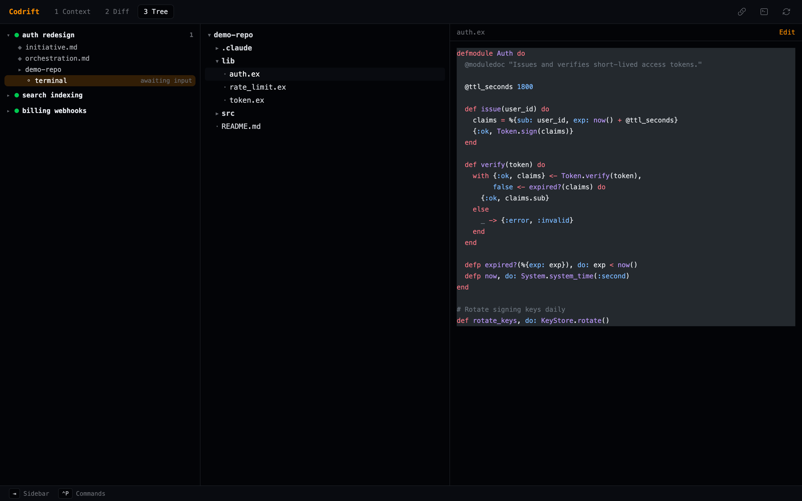

# Tree View (Mode 3)

Press `3` (or click **3 Tree**, or select *Tree view* from `Ctrl+P`) to browse
the files of the active initiative.



## Overview

Tree mode shows three panes: the initiative sidebar on the far left, a file tree
of the initiative's directories in the middle, and a syntax-highlighted preview
of the selected file on the right. Top-level directories are expanded by default;
directories are listed before files, both sorted alphabetically.

The file list comes from the `list_tree` RPC, which walks each directory in the
initiative (respecting `.gitignore` via `git ls-files`, with a naive fallback).

## Navigation

| Key / action | Effect |
|--------------|--------|
| Click a directory | Expand / collapse it |
| Click a file | Load it into the preview pane |
| `Tab` / `Shift+Tab` | Cycle focus between the sidebar and the terminal |
| Mouse wheel | Scroll the tree or the preview |

## Editing

The preview pane has an **Edit** button in its header. It opens the file in the
in-app editor — a full-screen CodeMirror pane with **Vim mode** enabled. Save
with `:w`, `:wq`, or `⌘S` / `Ctrl+S`; close with `:q`. See
[Keyboard reference → Editor](keyboard.md#editor).

Reads and writes go through the sandboxed `read_file` / `write_file` RPCs, which
refuse paths outside the initiative's allowed directories and cap previews at
512 KB (`Codrift.Files`).

## Syntax highlighting

Previews are highlighted with [Shiki](https://shiki.style) (theme
`github-dark`). `langForPath/1` in `assets/src/lib/highlight.ts` resolves the
language from the filename (e.g. `mix.exs`, `Dockerfile`) or extension. The
bundled grammar set covers, among others:

| Languages | Examples |
|-----------|----------|
| Elixir | `.ex` `.exs` |
| JavaScript / TypeScript | `.js` `.jsx` `.ts` `.tsx` |
| Svelte / Vue | `.svelte` `.vue` |
| Rust · Go · Python · Ruby | `.rs` `.go` `.py` `.rb` |
| C / C++ | `.c` `.h` `.cpp` |
| Shell | `.sh` `.bash` `.zsh` |
| Markup & data | `.html` `.css` `.scss` `.json` `.yaml` `.toml` `.md` |
| SQL · Docker | `.sql` `Dockerfile` |

Files with an unrecognised extension render as plain text (`"text"`).
```
